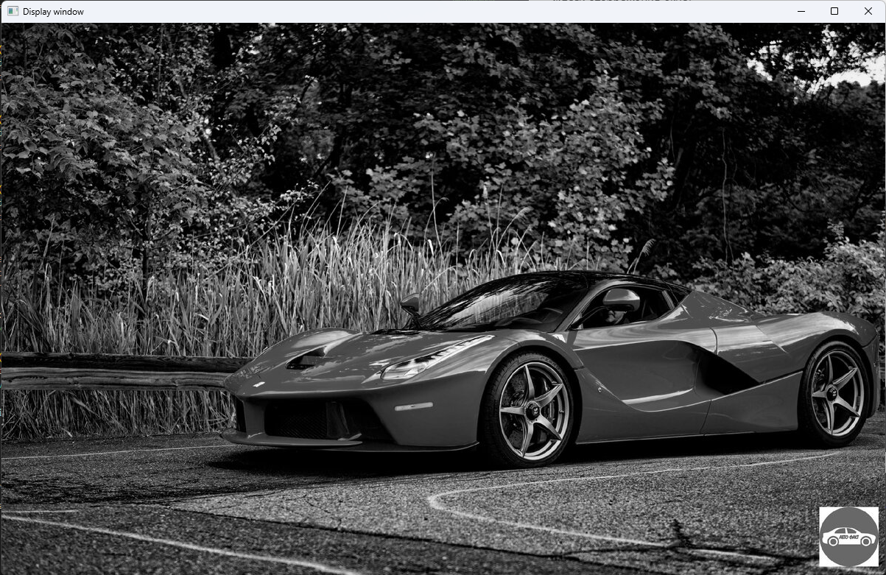
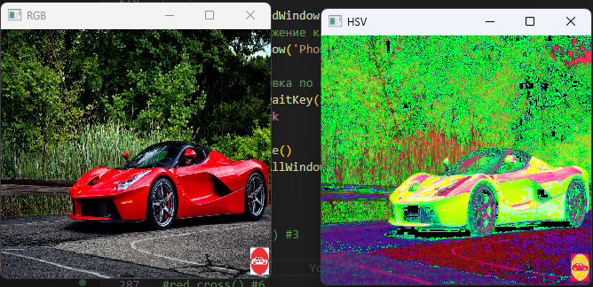
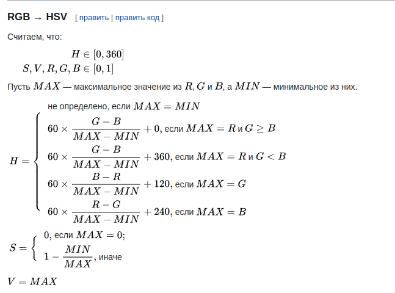
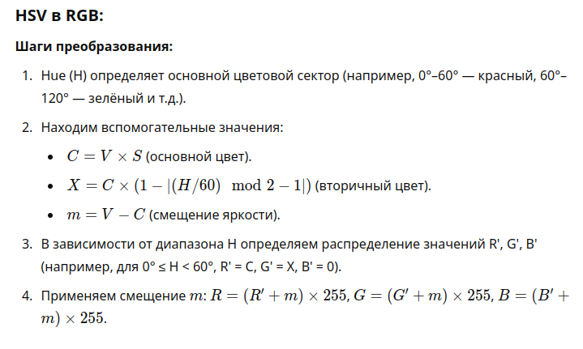
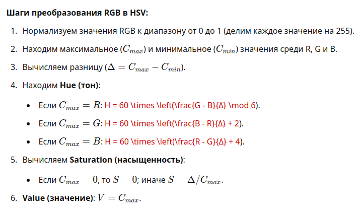
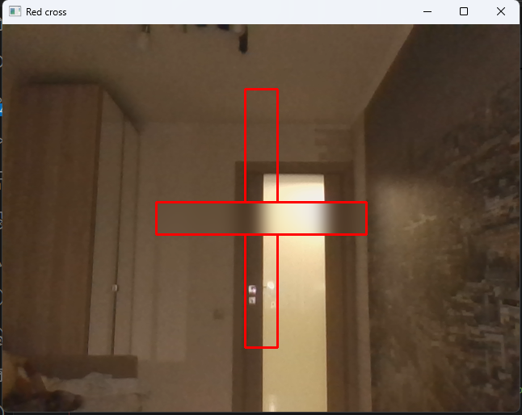
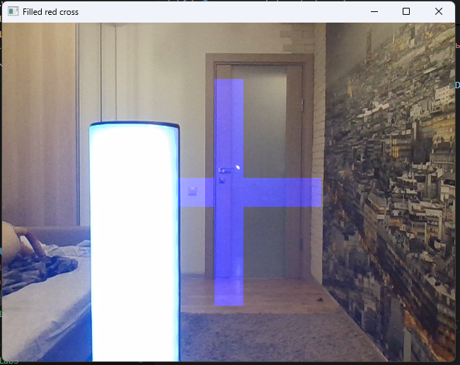

# Лабораторная работа №1 


1. Настроен проект, установлен opencv.


2. Выполнено задание 2, протестированы:
   - 3 расширения, 
   - 3 флага окна, 
   - 3 флага чтения изображения


imread - Для чтения изображений с различными флагами
namedWindow - Для настройки способа отображения
imshow - Для непосредственного отображения изображения в окне

```python
    image = cv2.imread("some_path", flags=some_flag)
    cv2.namedWindow("some_key", some_flag)
    cv2.imshow("some_key", image)
```
Флаги отображения окна:
   - cv2.WINDOW_GUI_NORMAL - стандартный GUI
   - cv2.WINDOW_AUTOSIZE - автоматический выбор размерности
   - cv2.WINDOW_GUI_EXPANDED - расширенный gui окна

Флаги чтения изображения:
   - cv2.IMREAD_COLOR - отсекает альфа канал
   - cv2.IMREAD_GRAYSCALE - читает в черно-белом формате
   - cv2.IMREAD_REDUCED_COLOR_8 - сжатие в 8 раз




3. Выполнено задание 3
   - отображено видео в окне
   - испробованы различные цветовые гаммы и размеры

   
VideoCapture - класс для чтения видеопотока
  
Источники:

  • Веб-камера (например, cv2.VideoCapture(0) для первой камеры)

   • Видео файлы (например, cv2.VideoCapture('video.mp4'))

   • RTSP или другие сетевые потоки.


```python
#захват видео
cap = cv2.VideoCapture(r'Lab1\kotik.MP4', cv2.CAP_ANY)

print_info(cap)

while True:
    ret, frame = cap.read()  # Чтение текущего кадра
    if not ret:  # Проверка на успешное чтение кадра
        break

    cv2.namedWindow('Kotik c galstukom', cv2.WINDOW_NORMAL)
    new_frame = cv2.cvtColor(frame, cv2.COLOR_BGR2GRAY) # отдельный метод поскольку VideoCapture не содержит методов изменения гаммы
    cv2.resizeWindow('Kotik c galstukom', 640, 480) # изменение размера окна
    cv2.imshow("Kotik c galstukom", new_frame)  # Отображение кадра

    # Ожидание 1 мс и проверка нажатия клавиши 'Esc' (код 27)
    if cv2.waitKey(20) & 0xFF == 27:
        break
```


4. Выполнено задание 4
   - Записано видео из одного файла в другой файл

VideoWriter - класс записи видеопотока

Методы:
   - write для вывода фрейма

VideoWriter_fourcc - класс кодировки, используемой для определения формата видеопотока

CoDec - Coder Decoder, иными словами Кодировщик и декодировщик мультимедиа, например видео, фото и т.д и тому подобное

Основной задачей является сжатие и затем восстановление изображения

MPEG-4 - кодек

mp4 - расширение, контейнер

```python
video = cv2.VideoCapture(r'Lab1\kotik.MP4', cv2.CAP_ANY)
ok, img = video.read()
w = int(video.get(cv2.CAP_PROP_FRAME_WIDTH))
h = int(video.get(cv2.CAP_PROP_FRAME_HEIGHT))
fps = video.get(cv2.CAP_PROP_FPS) #можно убрать и выбирать количество кадров; если оно больше чем реальное кол-во в видео, то видео будет ускорено

fourcc = cv2.VideoWriter_fourcc(*'XVID') #это функция, которая задаёт кодек для записи видео.fourcc — это "четырёхсимвольный код", который используется для обозначения формата кодека, применяемого для сжатия видеофайла.
video_writer = cv2.VideoWriter("save_video_result.avi", fourcc, fps, (w, h))
while (True):
    ok, img = video.read()
    if not ok:  # Проверка на успешное чтение кадра
        break

    cv2.imshow('The Cat', img)
    video_writer.write(img)
    if cv2.waitKey(20) & 0xFF == 27:
        break
```

5. Выполнено задание 5
   - Изображение сконвертировано в формат HSV


cvtColor - функция конверсии цвета изображения

COLOR_BGR2HSV - флаг из RGB в HSV

формулы:

Для HSV в RGB:



Для RGB в HSV:




Зачем нужен RGB -
RGB по умолчанию используется при подготовке изображений для цифровых носителей, 
потому что принцип ее работы аналогичен излучению монитора. 
Даже при создании макетов для печати работа на компьютере преимущественно ведется в RGB.


Преимущества:

1. Простота: Легко реализовать и понять.

2. Широкое использование: Является стандартом для большинства дисплеев, камер и графических редакторов.

3. Точное представление: Позволяет точно управлять цветами на экранах.

Недостатки:

1. Трудности в восприятии: Не всегда интуитивно понятно для работы с цветами, особенно для людей, не знакомых с цветовой теорией.

2. Сложности с манипуляциями: Операции, такие как изменение яркости или насыщенности, могут быть сложными.


HSV представляет цвет в терминах оттенка (Hue), 
насыщенности (Saturation) и яркости (Value). 
Оттенок определяет основной цвет, насыщенность указывает на "чистоту" цвета, 
а яркость определяет его светлоту.

Преимущества:

1. Интуитивное восприятие: Более естественное представление цвета для человека; легче работать с оттенками и насыщенностью.

2. Удобство для редактирования: Изменение насыщенности и яркости проще и понятнее.

3. Подходит для выбора цветов: Часто используется в графических редакторах и при создании интерфейсов для выбора цветов.


```python
cv2.cvtColor(image, cv2.COLOR_BGR2HSV)
```


6. Выполнено задание 6
   - Прочитано изображение с камеры. 
   - Выведено в центре на экране Красный крест в формате, как на изображении. 
   - Указаны команды, которые позволяют это сделать:
     - cv2.rectangle
     - cv2.stackBlur

Получение ширины и высоты кадра:
```python
    cap = cv2.VideoCapture(0)

    frame_w = int(cap.get(cv2.CAP_PROP_FRAME_WIDTH))
    frame_h = int(cap.get(cv2.CAP_PROP_FRAME_HEIGHT))
```

Рисование прямоугольников на кадре

используется метод rectangle

```python
        cv2.rectangle(frame, (x1 + offset_x, y1 + offset_y), (x2 + offset_x, y2 + offset_y), (0, 0, 255), 2)
```

Применение размытия в области прямоугольника
```python
#размытие горизонтальной линии
x1, y1 = rectangles[0][0]
x2, y2 = rectangles[0][1]
mask = np.zeros((frame_h, frame_w, 3), dtype=np.uint8)
mask = cv2.rectangle(mask, (x1 + offset_x, y1 + offset_y), (x2 + offset_x, y2 + offset_y), (255, 255, 255), -1)
#blur = cv2.stackBlur(frame, (63, 63))
blur = cv2.GaussianBlur(frame, (63, 63), 0)
frame[mask == 255] = blur[mask == 255]
```



7. Выполнено задание 7
   - Отображена информация с вебкамеры,
   - видео с вебкамеры записано в файл

Чтение потока с видеокамеры:
```python
 cap = cv2.VideoCapture(0)
```

8. Выполнено задание 8
   - Отображаем крест
   - Вычислен доминантный цвет в центральном пикселе креста
   - Заливаем крест вычесленным доминантным цветом


Извлекаем доминантный цвет
```python

def get_dominant_color(pixel):
    """Определяет преобладающий цвет по значению пикселя."""
    b, g, r = pixel
    if r > g and r > b:
        return (0, 0, 255)  # Красный
    elif g > r and g > b:
        return (0, 255, 0)  # Зеленый
    else:
        return (255, 0, 0)  # Синий

```



9. Выполнено задание 9
   - Настроен процесс подключения и стриминга с камеры устройства

Используется приложение ip webcam для стриминга видео с вебкамеры устройства

подключение идёт поверх протокола http

```python
video = cv2.VideoCapture("http://172.20.10.3:8080/video")
```
