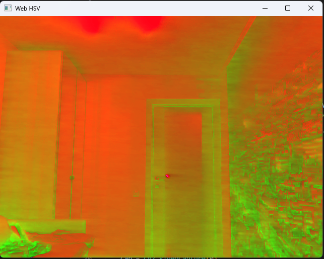
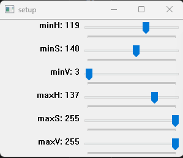
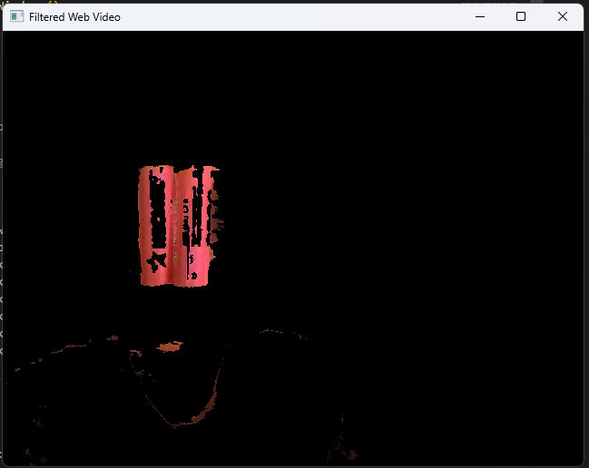
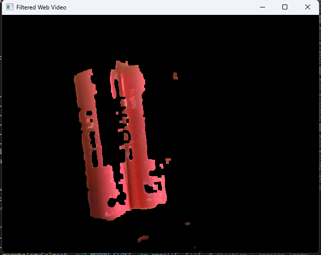
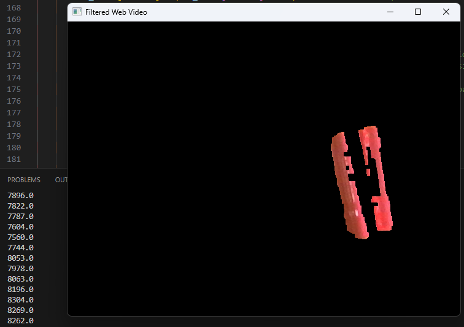
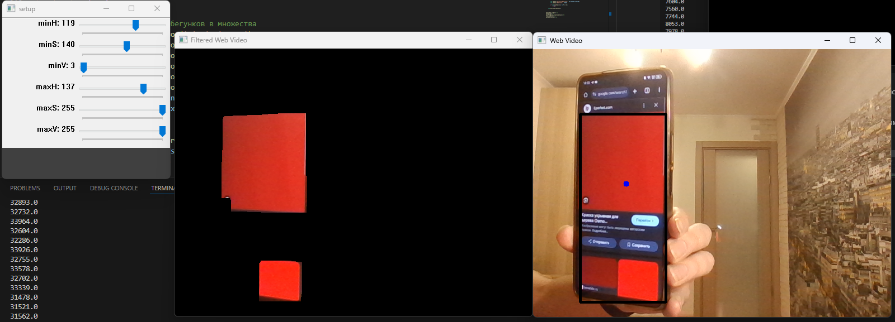

# Лабораторная работа №2

1. Прочитал изображение с камеры и перевёл его в формат
HSV

Используется функция cvtColor для конверсии фрейма во фрейм с HSV кодировкой цвета

```python
hsv_frame = cv2.cvtColor(frame, cv2.COLOR_BGR2HSV)
```



2. Применил фильтрацию изображения с помощью команды
inRange и оставил только красную часть, вывел получившееся изображение
на экран(treshold), выбрал красный объект и потестировал параметры
фильтрации, подобрав их нужного уровня

#### Код модификации фрейма
```python
#Преобразует кадр из цветового пространства BGR в HSV.
cv2.cvtColor(frame, cv2.COLOR_BGR2HSV_FULL)

#Корректирует компонент Hue, чтобы красный цвет оказался в центре цветового пространства (с учётом цикличности Hue).
hsv_frame[:, :, 0] = (hsv_frame[:, :, 0] + 128) % 0xFF

#Создаёт бинарную маску, где белый (255) означает пиксели, находящиеся в заданных пределах HSV.
cv2.inRange(hsv_frame, min_p, max_p)

#Применяет маску к исходному кадру, оставляя только те части изображения, которые соответствуют фильтру.
cv2.bitwise_and(frame, frame, mask=mask)
```

#### Выявленные настройки диапазона HSV для выявления красного объекта:



О inRange:
Метод cv2.inRange(src, lowerb, upperb) из библиотеки OpenCV используется для создания бинарной маски, выделяющей пиксели изображения, которые находятся в заданном диапазоне значений

Совместим с любой цветовой моделью (BGR, HSV, GRAY и т.д.).



3. Провёл морфологические преобразования (открытие и
закрытие) фильтрованного изображения, вывел результаты на экран

```python
mask = cv2.morphologyEx(mask, cv2.MORPH_OPEN, np.ones((5, 5)))  # erosion + dilation (remove small objects)
mask = cv2.morphologyEx(mask, cv2.MORPH_CLOSE, np.ones((5, 5)))  # dilation + erosion (remove small holes)
```
Морфологические операции:

MORPH_OPEN: Удаляет мелкие шумы (последовательность операций эрозии и дилатации).

MORPH_CLOSE: Закрывает мелкие "дырки" внутри объектов (последовательность операций дилатации и эрозии).

np.ones((10, 10)): Структурный элемент (размер 10x10 пикселей) для операций.

#### Эрозия (Erosion)

Что делает:

Уменьшает размеры белых областей.
"Съедает" границы объектов, убирает мелкие шумы и тонкие детали.

Как работает:

К каждому белому пикселю (255) применяется структурный элемент (обычно это прямоугольник, круг или крест).
Если хотя бы один пиксель из области, покрытой структурным элементом, не является белым, то центральный пиксель становится чёрным (0).
Пример использования:

Удаление мелких шумов.
Разделение объектов, которые соединены тонкими линиями.

##### Дилатация (Dilation)
Что делает:

Увеличивает размеры белых областей.

"Расширяет" границы объектов, закрывает мелкие дырки.

Как работает:

К каждому чёрному пикселю (0) применяется структурный элемент.

Если хотя бы один пиксель из области, покрытой структурным элементом, белый (255), то центральный пиксель становится белым.
Пример использования:

Закрытие мелких дырок внутри объектов.
Увеличение размеров объектов для выделения более чётких форм.



4. Нашёл моменты на полученном изображении 1 первого
порядка, нашёл площадь объекта.

```python
moments = cv2.moments(mask, True)
print(moments['m00']) #вывод площади объекта
```

Моменты изображения — это математические характеристики, 
которые позволяют анализировать свойства объектов на изображении, такие как площадь, 
центр тяжести, угол поворота, и другие. 

Они особенно полезны для анализа формы и положения объектов.

m00: Площадь объекта (сумма всех пикселей изображения).

m10 и m01: Моменты первого порядка, используются для нахождения центра тяжести объекта.

Централизованные моменты: mu20, mu11, mu02




5. На основе анализа площади объекта нашёл его центр и
построил черный прямоугольник вокруг объекта. 

Сделал так, чтобы на видео
выводился полученный черный прямоугольник, причем на новом кадре
новый.



```python
moments = cv2.moments(mask, True)
print(moments['m00']) #вывод площади объекта

m01 = moments['m01']  # Y
m10 = moments['m10']  # X
area = moments['m00']
if area > 100:
    posX = int(m10 / area)
    posY = int(m01 / area)
    cv2.circle(frame, (posX, posY), 5, (255, 0, 0), -1)

    x, y, w, h = cv2.boundingRect(mask)
    cv2.rectangle(frame, (x, y), (x + w, y + h), (0, 0, 0), 3)
```

Вычисляются моменты бинарной маски, включая площадь объекта (m00).
Если площадь больше порога (area > 100):
    Определяется центр масс объекта (posX, posY), и рисуется круг.
    Строится ограничивающий прямоугольник вокруг объекта.

m10 - это сумма произведений координат x всех пикселей на их интенсивности
m01 - это сумма произведений координат y всех пикселей на их интенсивности
