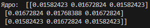
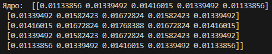
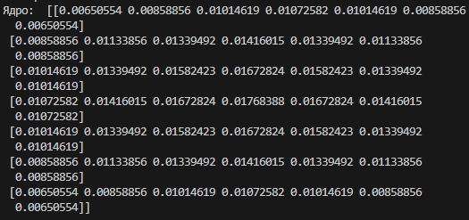
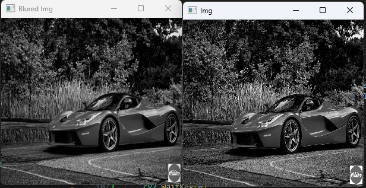
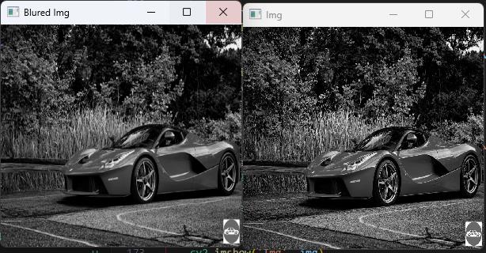
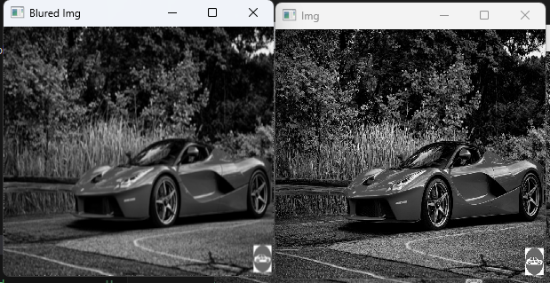
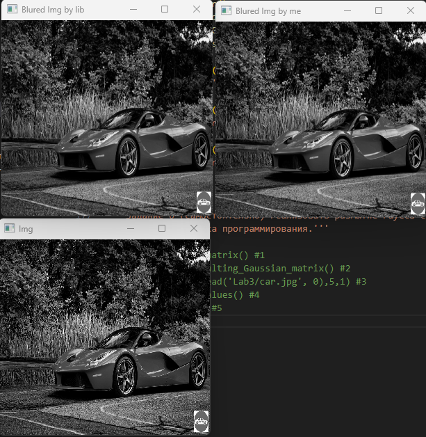

# Лабораторная работа № 3
1. Был разработан метод, считающий матрицу гаусса заданного размера

Значение параметра фильтрации: 1
Результат:
Размер: 3



Размер 5:



Размер 7:



2. Был разработан метод, осуществляющий нормирование матрицы гаусса


3. Был разработан метод, осуществляющий фильтрацию изображения при помощи разработанного метода фильтрации гаусса



4. Испробовал блюр на различных параметрах:

Размерность 5. Отклонение – 1



Размерность 7. Отклонение – 3



5. Была сделана реализация рызмытия при помощи встроенных методов OpenCV



6. Имплементировал алгоритм с использованием C++

```cpp
#include <iostream>
#include <vector>
#include <cmath>
#include <opencv2/opencv.hpp>

using namespace std;
using namespace cv;

// Функция Гаусса
double gauss_func(double deviation, int a, int b, int i, int j) {
    return exp(-((pow(i - a, 2) + pow(j - b, 2)) / (2 * pow(deviation, 2)))) / (2 * 3.14 * pow(deviation, 2));
}

// Функция размытия по Гауссу
Mat GaussBlur(const Mat& img, int k_size, double deviation) {
    int height = img.rows;
    int width = img.cols;

    // Создание ядра
    vector<vector<double>> kernel(k_size, vector<double>(k_size, 0));
    int a = k_size / 2; // Математическое ожидание - центр ядра
    int b = k_size / 2;

    for (int i = 0; i < k_size; ++i) {
        for (int j = 0; j < k_size; ++j) {
            kernel[i][j] = gauss_func(deviation, a, b, i, j);
        }
    }

    // Печать отклонения и размерности
    cout << "Отклонение: " << deviation << endl;
    cout << "Размерность: " << k_size << endl;
    cout << "Ядро до нормализации: " << endl;
    for (const auto& row : kernel) {
        for (double value : row) {
            cout << value << " ";
        }
        cout << endl;
    }

    // Нормализация ядра
    double sum = 0;
    for (int i = 0; i < k_size; ++i) {
        for (int j = 0; j < k_size; ++j) {
            sum += kernel[i][j];
        }
    }

    for (int i = 0; i < k_size; ++i) {
        for (int j = 0; j < k_size; ++j) {
            kernel[i][j] /= sum;
        }
    }

    cout << "Ядро после нормализации: " << endl;
    for (const auto& row : kernel) {
        for (double value : row) {
            cout << value << " ";
        }
        cout << endl;
    }

    // Применение фильтра к изображению
    Mat blured_img = img.clone();

    for (int x = k_size / 2; x < height - k_size / 2; ++x) {
        for (int y = k_size / 2; y < width - k_size / 2; ++y) {
            double val = 0;
            for (int k = -k_size / 2; k <= k_size / 2; ++k) {
                for (int l = -k_size / 2; l <= k_size / 2; ++l) {
                    val += img.at<uchar>(x + k, y + l) * kernel[k + (k_size / 2)][l + (k_size / 2)];
                }
            }
            blured_img.at<uchar>(x, y) = static_cast<uchar>(val);
        }
    }

    return blured_img;
}

int main() {
    cerr << "Ошибка: не удалось загрузить изображение!" << endl;
    return -1;
    // Пример использования
    Mat img = imread("car.jpg", IMREAD_GRAYSCALE); // Чтение изображения в градациях серого
    if (img.empty()) {
        cerr << "Ошибка: не удалось загрузить изображение!" << endl;
        return -1;
    }

    int k_size = 5;
    double deviation = 1.0;

    Mat blured_img = GaussBlur(img, k_size, deviation);
    imshow("Original Image", img);
    imshow("Blurred Image", blured_img);
    waitKey(0);

    return 0;
}
```