# Лабораторная работа № 4

1.  Реализован метод, который:
    - принимает в качестве строки
    - полный адрес файла изображения
    - читает изображение,
    - переводит его в черно белый цвет и выводит его на экран 
    - применяет размытие по Гауссу и выводит полученное изображение на экран

```python
# Инициализируем класс
kaniAlgo = KaniAlgorythm(
    image_size=(500,500),
    image_show_list=[
        ImageShowKaniAlgorythmEnum.GRAYSCALE,
        ImageShowKaniAlgorythmEnum.GRAYSCALE,
    ],
    kernel_size=5,
    deviation=1.5
)

# Обрабатываем изображение
kaniAlgo.process_image('files/1.jpg')
```

Демонстрация:

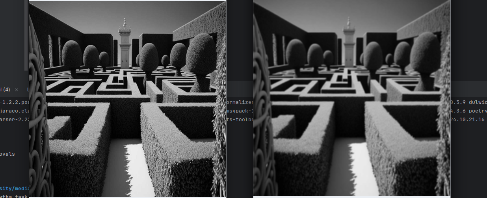

2. Модифицировать построенный метод:
    - Вычисляляю и вывожу на экран две матрицы – матрица значений длин и матрица значений углов градиентов всех пикселей изображения.

Для нахождения градиента изображения используется оператор собеля

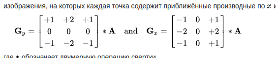

Как высчитывать градиент для матрицы:

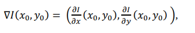

Градиент - это частичные производные по x и y, если рассматривать матрицу изобрежения как функцию от двух параметров

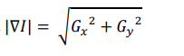

формула просчёта угла градиента:

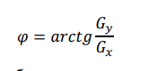


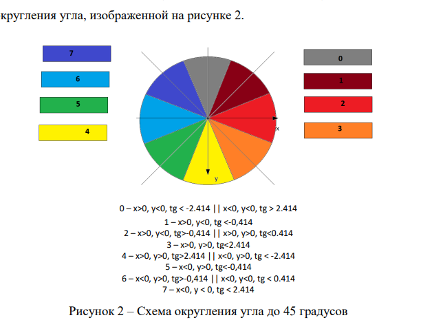

Вычисляем угол на основе градиента:

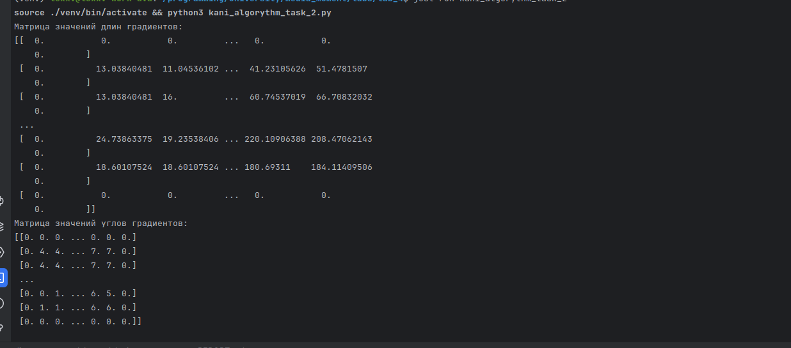

3. Модифицировал метод так, чтобы он выполнял подавление
немаксимумов и выводил полученное изображение на экран.

Подавляем немаксимумы

> границей будет считаться пиксель, градиент которого
максимален в сравнении с пикселями по направлению
наибольшего роста функции. в нашем примере, направление задано
числом 6, то есть направление вдоль оси x, рассматриваем значение градиента 
в пикселях слева и справа от заданного. если значение градиента
выше, чем у пикселей слева и справа, то данный пиксель –
это граница, иначе – не граница.

Получаем длину градиентов двух соседних пикселей исходя из направления градиента


На изображении были подавлены пиксели, которые не являются локальными максимуми, инымми словами были выделены граница объектов 

ГРАНИЦЕЙ БУДЕТ СЧИТАТЬСЯ ПИКСЕЛЬ, ГРАДИЕНТ КОТОРОГО
МАКСИМАЛЕН В СРАВНЕНИИ С ПИКСЕЛЯМИ ПО НАПРАВЛЕНИЮ
НАИБОЛЬШЕГО РОСТА ФУНКЦИИ

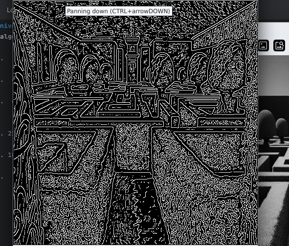

4. Проведу двойную пороговую фильтрацию

Суть метода:

```python
max_gradient = np.max(grads_len)
print(max_gradient)
lower_bound = max_gradient / self._threshold_dividers[0]
upper_bound = max_gradient / self._threshold_dividers[1]
```

- Ставим MAX и MIN границы значенния градиента
- Фильтруем границы. Если > MAX, то точно граница Если < MIN то точно не граница, дале рассматриваем < MAX и > MIN

Те значения что внутри диапазона мы проверяем пограничные пиксели, если хотя бы 1 - граница то и этот граница.


## Результаты:

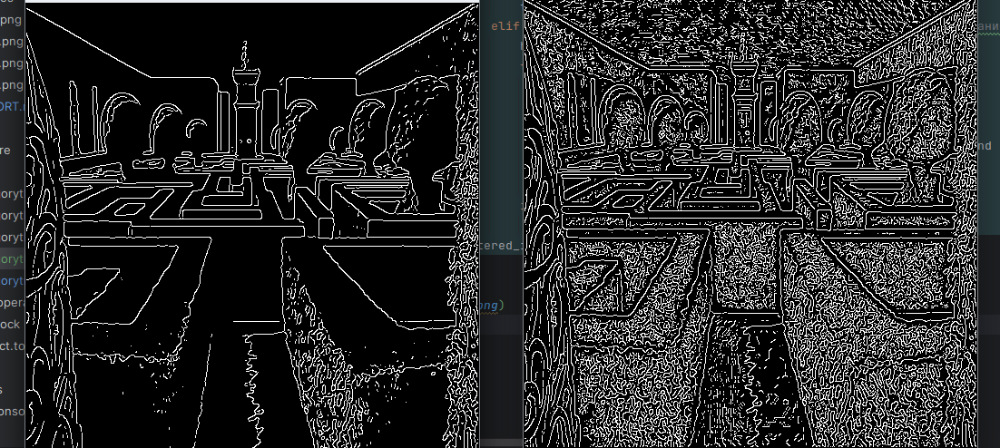

### Провёл опыты для различных параметров размытия и пороговых значений

Размытие - 1.5


Размытие - 3

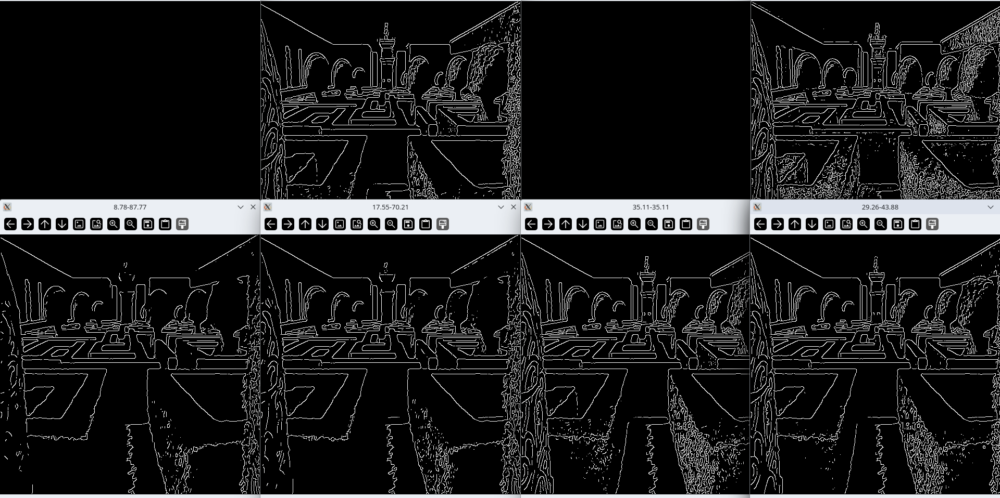

Размытие - 10

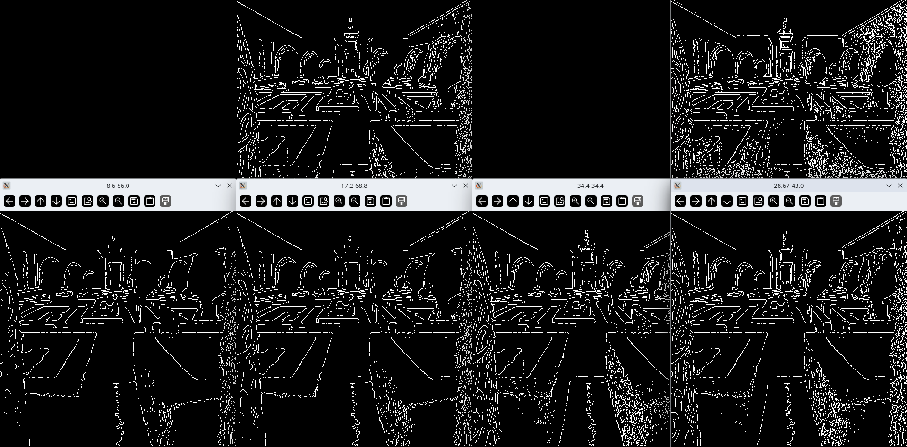

Размытие - 0.001

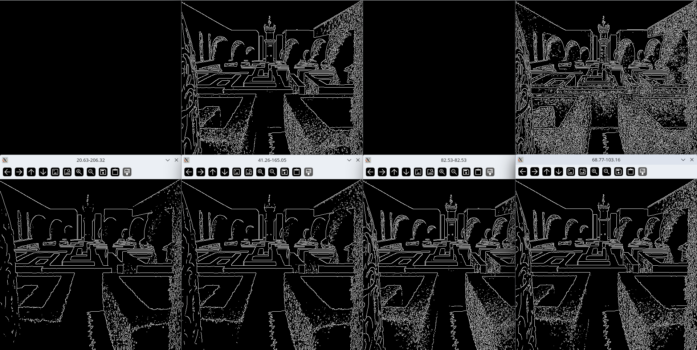

5. Реализована программа на языке c++
