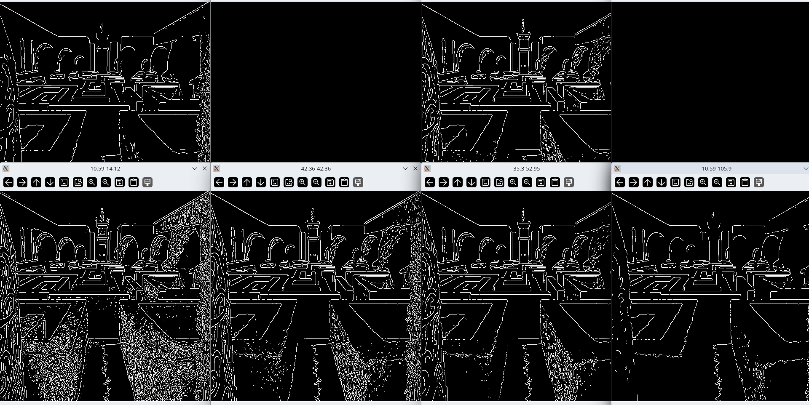

# Лабораторная работа № 4

1.  Реализован метод, который:
    - принимает в качестве строки
    - полный адрес файла изображения
    - читает изображение,
    - переводит его в черно белый цвет и выводит его на экран 
    - применяет размытие по Гауссу и выводит полученное изображение на экран

```python
# Инициализируем класс
kaniAlgo = KaniAlgorythm(
    image_size=(500,500),
    image_show_list=[
        ImageShowKaniAlgorythmEnum.GRAYSCALE,
        ImageShowKaniAlgorythmEnum.GRAYSCALE,
    ],
    kernel_size=5,
    deviation=1.5
)

# Обрабатываем изображение
kaniAlgo.process_image('Lab4/files/1.jpg')
```

Демонстрация:


2. Модифицировать построенный метод:
    - Вычисляляю и вывожу на экран две матрицы – матрица значений длин и матрица значений углов градиентов всех пикселей изображения.

Для нахождения градиента изображения используется оператор собеля


Как высчитывать градиент для матрицы:


Градиент - это частичные производные по x и y, если рассматривать матрицу изобрежения как функцию от двух параметров


формула просчёта угла градиента:


Вычисляем угол на основе градиента:


3. Модифицировал метод так, чтобы он выполнял подавление
немаксимумов и выводил полученное изображение на экран.

Подавляем немаксимумы

> границей будет считаться пиксель, градиент которого
максимален в сравнении с пикселями по направлению
наибольшего роста функции. в нашем примере, направление задано
числом 6, то есть направление вдоль оси x, рассматриваем значение градиента 
в пикселях слева и справа от заданного. если значение градиента
выше, чем у пикселей слева и справа, то данный пиксель –
это граница, иначе – не граница.

Получаем длину градиентов двух соседних пикселей исходя из направления градиента


На изображении были подавлены пиксели, которые не являются локальными максимуми, инымми словами были выделены граница объектов 

ГРАНИЦЕЙ БУДЕТ СЧИТАТЬСЯ ПИКСЕЛЬ, ГРАДИЕНТ КОТОРОГО
МАКСИМАЛЕН В СРАВНЕНИИ С ПИКСЕЛЯМИ ПО НАПРАВЛЕНИЮ
НАИБОЛЬШЕГО РОСТА ФУНКЦИИ


4. Проведу двойную пороговую фильтрацию

Суть метода:

```python
max_gradient = np.max(grads_len)
print(max_gradient)
lower_bound = max_gradient / self._threshold_dividers[0]
upper_bound = max_gradient / self._threshold_dividers[1]
```

- Ставим MAX и MIN границы значенния градиента
- Фильтруем границы. Если > MAX, то точно граница Если < MIN то точно не граница, дале рассматриваем < MAX и > MIN

Те значения что внутри диапазона мы проверяем пограничные пиксели, если хотя бы 1 - граница то и этот граница.


## Результаты:


### Провёл опыты для различных параметров размытия и пороговых значений

Размытие - 1.5



Размытие - 3


Размытие - 10


Размытие - 0.001


5. Реализована программа на языке c++

```cpp
#include <iostream>
#include <vector>
#include <cmath>
#include <opencv2/opencv.hpp>

using namespace cv;
using namespace std;

// Гауссово размытие
Mat GaussBlur(const string& img_path, int k_size, double deviation) {
    Mat img = imread(img_path, IMREAD_GRAYSCALE);
    Mat blurred;
    GaussianBlur(img, blurred, Size(k_size, k_size), deviation);
    return blurred;
}

// Свертка с ядром
Mat convolution(const Mat& img, const Mat& kernel) {
    Mat result = Mat::zeros(img.size(), CV_32F);
    int k_size = kernel.rows;
    int offset = k_size / 2;

    for (int y = offset; y < img.rows - offset; ++y) {
        for (int x = offset; x < img.cols - offset; ++x) {
            float val = 0.0;
            for (int i = -offset; i <= offset; ++i) {
                for (int j = -offset; j <= offset; ++j) {
                    val += img.at<uchar>(y + i, x + j) * kernel.at<float>(i + offset, j + offset);
                }
            }
            result.at<float>(y, x) = val;
        }
    }

    return result;
}

// Определение угла
int getAngleSector(float gx, float gy) {
    float angle = atan2(gy, gx) * 180 / CV_PI;
    angle = angle < 0 ? angle + 180 : angle;

    if ((angle >= 0 && angle < 22.5) || (angle >= 157.5 && angle < 180)) return 0;
    if (angle >= 22.5 && angle < 67.5) return 1;
    if (angle >= 67.5 && angle < 112.5) return 2;
    if (angle >= 112.5 && angle < 157.5) return 3;

    return -1;  // Неопределённое направление
}

// Подавление немаксимумов
Mat nonMaximumSuppression(const Mat& magnitude, const Mat& grad_x, const Mat& grad_y) {
    Mat result = Mat::zeros(magnitude.size(), CV_8U);

    for (int y = 1; y < magnitude.rows - 1; ++y) {
        for (int x = 1; x < magnitude.cols - 1; ++x) {
            int angle = getAngleSector(grad_x.at<float>(y, x), grad_y.at<float>(y, x));
            float current = magnitude.at<float>(y, x);
            float q = 0, r = 0;

            if (angle == 0) {
                q = magnitude.at<float>(y, x - 1);
                r = magnitude.at<float>(y, x + 1);
            }
            else if (angle == 1) {
                q = magnitude.at<float>(y - 1, x + 1);
                r = magnitude.at<float>(y + 1, x - 1);
            }
            else if (angle == 2) {
                q = magnitude.at<float>(y - 1, x);
                r = magnitude.at<float>(y + 1, x);
            }
            else if (angle == 3) {
                q = magnitude.at<float>(y - 1, x - 1);
                r = magnitude.at<float>(y + 1, x + 1);
            }

            if (current >= q && current >= r) {
                result.at<uchar>(y, x) = 255;
            }
        }
    }

    return result;
}

// Двойная пороговая фильтрация
Mat doubleThreshold(const Mat& img, const Mat& gradient, float low_thresh, float high_thresh) {
    Mat result = Mat::zeros(img.size(), CV_8U);

    for (int y = 0; y < img.rows; ++y) {
        for (int x = 0; x < img.cols; ++x) {
            float grad_val = gradient.at<float>(y, x);
            if (grad_val >= high_thresh) {
                result.at<uchar>(y, x) = 255;
            }
            else if (grad_val >= low_thresh) {
                bool connected = false;
                for (int i = -1; i <= 1; ++i) {
                    for (int j = -1; j <= 1; ++j) {
                        if (result.at<uchar>(y + i, x + j) == 255) {
                            connected = true;
                            break;
                        }
                    }
                    if (connected) break;
                }
                if (connected) result.at<uchar>(y, x) = 255;
            }
        }
    }

    return result;
}

void CannyMethod(const string& img_path, int kernel_size = 5, double deviation = 1.0, float low_thresh = 50, float high_thresh = 150) {
    Mat blurred = GaussBlur("C:/Users/shema/PycharmProjects/multimedia processing algorithm/ferrari.jpg", kernel_size, deviation);

    Mat sobelX = (Mat_<float>(3, 3) << -1, 0, 1, -2, 0, 2, -1, 0, 1);
    Mat sobelY = (Mat_<float>(3, 3) << -1, -2, -1, 0, 0, 0, 1, 2, 1);

    Mat grad_x = convolution(blurred, sobelX);
    Mat grad_y = convolution(blurred, sobelY);

    Mat grad_magnitude;
    magnitude(grad_x, grad_y, grad_magnitude);

    double minVal, maxVal;
    minMaxLoc(grad_magnitude, &minVal, &maxVal);

    Mat suppressed = nonMaximumSuppression(grad_magnitude, grad_x, grad_y);

    Mat thresholded = doubleThreshold(suppressed, grad_magnitude, low_thresh, high_thresh);

    imshow("Blurred", blurred);
    imshow("Suppressed", suppressed);
    imshow("Thresholded", thresholded);
    waitKey(0);
}

int main() {
    string img_path = "ferrari.jpg";
    CannyMethod(img_path, 5, 1.0, 50, 150);
    return 0;
}

```